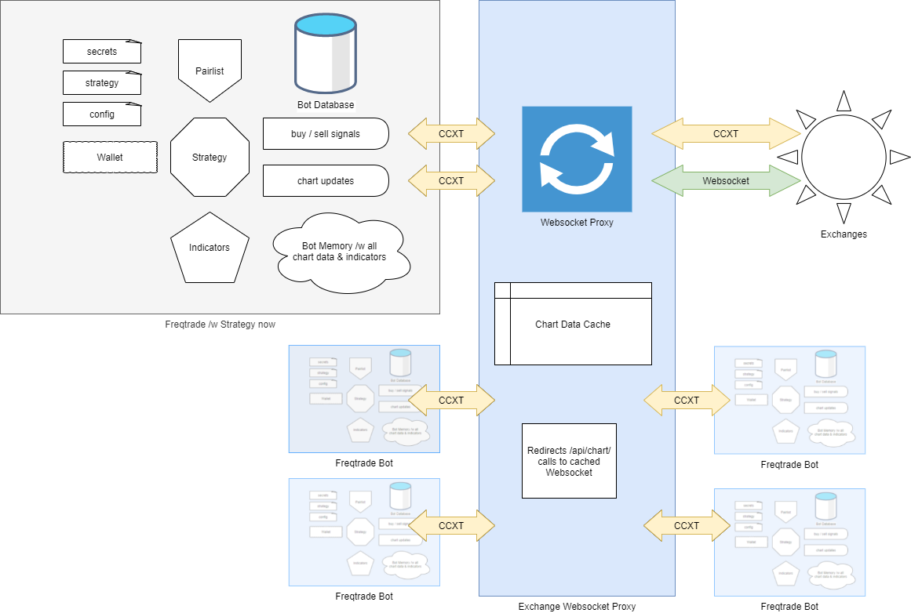

# binanceus-proxy

Long story short a binance proxy for freqtrade that is using websockets to maintain candlestick/klines data in memory, thus having great performance and reducing the amount of API calls to the Binance api.
All other calls are proxied as usual.



Start the docker instance and then point freqtrade to it, rate limit can be disabled:
```
docker pull  pnmice/binanceus-proxy:1.0-js

    "exchange": {
        "name": "binance",
        "key": "",
        "secret": "",
        "ccxt_config": {
            "enableRateLimit": false,
            "urls": {
                "api": {
                    "public": "http://127.0.0.1:8090/api/v3"
                }
            }
        },
        "ccxt_async_config": {
            "enableRateLimit": false
        }
    }
```
Thank you [@abanchev](https://github.com/abanchev) for project [here](https://github.com/abanchev/binance-proxy)
